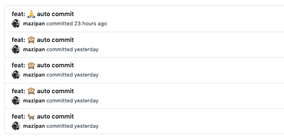

# auto-commit

🌳 Making green your Github stats, powered by [Github Actions](https://github.com/features/actions)

## Make it your own

- Create your own repo with click "**Use this template**" button (forked repo will not work)

Or just do in the manual way:

- Create your own repo
- Copy file `.github/workflows/autocommit.yml` and `LAST_UPDATED` to your repo
- Change the `email` and `name` information on file [autocommit.yml, line 29 and 30](https://github.com/mazipan/auto-commit/blob/master/.github/workflows/autocommit.yml#L29)
- Change the scheduling time on file [autocommit.yml, line 10](https://github.com/mazipan/auto-commit/blob/master/.github/workflows/autocommit.yml#L10). You can use [crontab.guru](https://crontab.guru/) if you are not familiar with the cron schedule string. For first time, you can try to run it in every hour with string `1 * * * *` .
- Consider to support me, at least click the 🌟 button

## Article (in Bahasa Indonesia)

- https://mazipan.space/membuat-commit-otomatis-ke-github/

## Repo using this auto-commit

- You can add your repo here

## Credits

- [Github Actions](https://github.com/features/actions)
- [ad-m/github-push-action](https://github.com/ad-m/github-push-action)

## Consider to Support

- 👉 🇮🇩 [Trakteer](https://trakteer.id/mazipan?utm_source=github)
- 👉 🌍 [Paypal](https://www.paypal.me/mazipan?utm_source=github)
- 👉 🌍 [Ko-Fi](https://ko-fi.com/mazipan)

---

© 2020 Crafted by Irfan Maulana

## Kevin Bell Schedule

schedule:
  - cron: "0 9 * * *"
  
  Daily at 9am
  
== We're Using GitHub Under Protest ==

This project is currently hosted on GitHub.  This is not ideal; GitHub is a
proprietary, trade-secret system that is not Free and Open Souce Software
(FOSS).  We are deeply concerned about using a proprietary system like GitHub
to develop our FOSS project. I have a [website](https://bellKevin.me) where the
project contributors are actively discussing how we can move away from GitHub
in the long term.  We urge you to read about the [Give up GitHub](https://GiveUpGitHub.org) campaign 
from [the Software Freedom Conservancy](https://sfconservancy.org) to understand some of the reasons why GitHub is not 
a good place to host FOSS projects.

If you are a contributor who personally has already quit using GitHub, please
email me at **bellKevin@pm.me** for how to send us contributions without
using GitHub directly.

Any use of this project's code by GitHub Copilot, past or present, is done
without our permission.  We do not consent to GitHub's use of this project's
code in Copilot.

